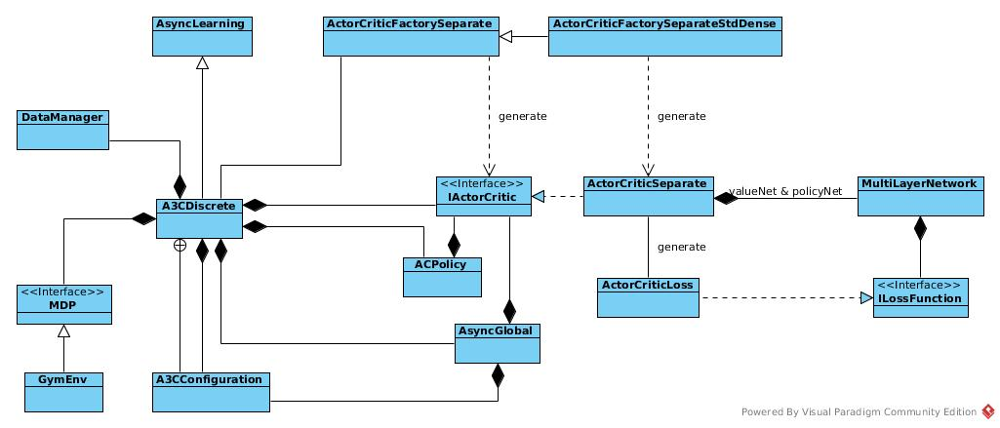
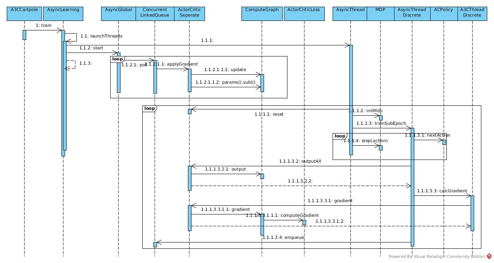

# A3C Cartepole
The figures in this link explain what A3C is doing.
[Simple Reinforcement Learning with Tensorflow Part 8: Asynchronous Actor-Critic Agents (A3C)](https://medium.com/emergent-future/simple-reinforcement-learning-with-tensorflow-part-8-asynchronous-actor-critic-agents-a3c-c88f72a5e9f2)
## Architecture



## Sequence



## Calculation

In this example, value net and policy net are two independent NN, and they are treated independently
### Global Thread

AsyncGlobal polls the queue and updates the network timely. Then update target network in some condition in double NN case

```
    public void run() {

        while (!isTrainingComplete() && running) {
            if (!queue.isEmpty()) {
                Pair<Gradient[], Integer> pair = queue.poll();
                T.addAndGet(pair.getSecond());
                Gradient[] gradient = pair.getFirst();
                synchronized (this) {
                    current.applyGradient(gradient, pair.getSecond());
                }
                if (a3cc.getTargetDqnUpdateFreq() != -1
                                && T.get() / a3cc.getTargetDqnUpdateFreq() > (T.get() - pair.getSecond())
                                                / a3cc.getTargetDqnUpdateFreq()) {
                    log.info("TARGET UPDATE at T = " + T.get());
                    synchronized (this) {
                        target.copy(current);
                    }
                }
            }
        }

    }

```

Workers send gradients for value net and policy net as an array and update them accordingly

```
ActorCriticSeparate.applyGradient(Gradient[] gradient, int batchSize) {
        MultiLayerConfiguration valueConf = valueNet.getLayerWiseConfigurations();
        int valueIterationCount = valueConf.getIterationCount();
        valueNet.getUpdater().update(valueNet, gradient[0], valueIterationCount, batchSize);
        valueNet.params().subi(gradient[0].gradient());
        Collection<IterationListener> valueIterationListeners = valueNet.getListeners();
        if (valueIterationListeners != null && valueIterationListeners.size() > 0) {
            for (IterationListener listener : valueIterationListeners) {
                listener.iterationDone(valueNet, valueIterationCount);
            }
        }
        valueConf.setIterationCount(valueIterationCount + 1);

        MultiLayerConfiguration policyConf = policyNet.getLayerWiseConfigurations();
        int policyIterationCount = policyConf.getIterationCount();
        policyNet.getUpdater().update(policyNet, gradient[1], policyIterationCount, batchSize);
        policyNet.params().subi(gradient[1].gradient());
        Collection<IterationListener> policyIterationListeners = policyNet.getListeners();
        if (policyIterationListeners != null && policyIterationListeners.size() > 0) {
            for (IterationListener listener : policyIterationListeners) {
                listener.iterationDone(policyNet, policyIterationCount);
            }
        }
        policyConf.setIterationCount(policyIterationCount + 1);
}
```

The updater for both of them are initiated in ActorCriticFactorySeparateStdDense.buildActorCritic() as default updater: Adam

### Worker Thread
The worker is running in similar way as DQN does. There are three minor differences:
* Networks are not updated in worker. Workers make use of network while not train them
* We are training V instead of Q, so the labels for value network is simple reward, not something about next state.

    About above differences, they could be proved in AsyncThreadDiscrete.trainSubEpoch() and A3CThreadDiscrete.calcGradient()

The last one is a special loss function for policy network which implemented as ActorCriticLoss
#### ActorCriticLoss
```
    public INDArray computeGradient(INDArray labels, INDArray preOutput, IActivation activationFn, INDArray mask) {
        INDArray output = activationFn.getActivation(preOutput.dup(), true).addi(1e-5);
        INDArray logOutput = Transforms.log(output, true);
        INDArray entropyDev = logOutput.addi(1);
        INDArray dLda = output.rdivi(labels).subi(entropyDev.muli(BETA)).negi();
        INDArray grad = activationFn.backprop(preOutput, dLda).getFirst();

        if (mask != null) {
            LossUtil.applyMask(grad, mask);
        }
        return grad;
    }
```

As declared in [reference](https://arxiv.org/pdf/1602.01783.pdf), the loss function is
L = log(π)(R - V) + BETA * H(π)

Make A = R - V

π is output of policy network, θ is W in previous networks descriptions.

Get π and log(π)

```
        INDArray output = activationFn.getActivation(preOutput.dup(), true).addi(1e-5);
        INDArray logOutput = Transforms.log(output, true);
```

Get (- d(H) / d(π))

H(π) = - (Σπi * log(πi))

d(H) / d(πi) = (1 + log(πi))

```
        INDArray entropyDev = logOutput.addi(1);
```

Get d(L) / d(π)

d(L) / d(πi) = A / πi - (1 + log(πi))

A are labels computed in trainSubEpoch

```
        INDArray dLda = output.rdivi(labels).subi(entropyDev.muli(BETA)).negi();
```

d(L) / d(θ) = (d(L) / d(π)) * (d(π) / d(θ))

In following sentence, backprop is doing this job and dLda is d(L) / d(π)

```
        INDArray grad = activationFn.backprop(preOutput, dLda).getFirst();
```

